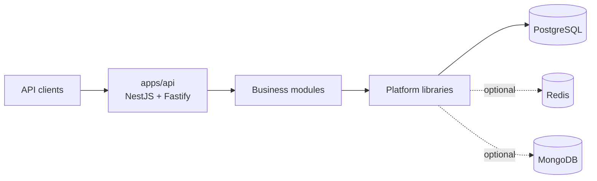
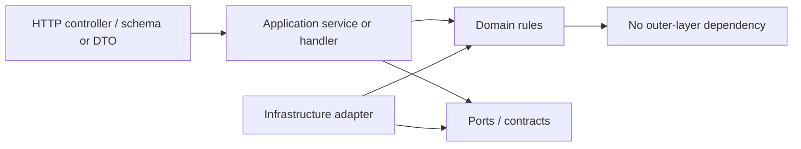

# Architecture

## Summary

The backend is a **modular monolith**: one NestJS process, one deployment unit, and multiple business bounded contexts with enforced dependency boundaries. This gives the project simple local transactions and operations while keeping future extraction possible when a context genuinely needs independent scaling, release cadence, or fault isolation.

## Repository layers

| Layer            | Location             | Responsibility                                                                    | May depend on                                    |
| ---------------- | -------------------- | --------------------------------------------------------------------------------- | ------------------------------------------------ |
| Composition root | `apps/api`           | Bootstrap, module composition, health endpoints                                   | Platform and module public APIs                  |
| Business         | `libs/modules/*`     | Bounded contexts and feature slices                                               | Own internals, platform contracts, shared kernel |
| Platform         | `libs/platform/*`    | HTTP, configuration, persistence connections, cache, logging, messaging, security | External technical libraries                     |
| Shared kernel    | `libs/shared-kernel` | Small stable domain-neutral primitives                                            | No business or platform libraries                |

The composition root wires modules together; it does not own business workflows. A business module owns its transport boundary, application services/handlers, domain model, persistence adapters, and tests.

## Dependency direction

- Controllers translate transport input and output. They do not contain business decisions.
- Application services/handlers coordinate a use case and depend on ports rather than concrete infrastructure.
- Domain code expresses business rules and should remain framework-agnostic where practical.
- Infrastructure implements ports and owns SQL repositories, provider SDKs, storage, and other technical details.
- SQL repositories and query files are private to their owning bounded context.

## Feature slices

Features live under `libs/modules/<context>/src/features/<feature>`. A slice keeps its controller, request schemas/DTOs, application service or command/handler, module wiring, persistence collaborators, and focused tests together. This limits merge contention and makes the unit of ownership visible in the filesystem.

The auth context is the current service-based example: each feature keeps its
controller, service, and schema together; repositories sit beside the feature
that owns the data. Cross-feature contracts live under `auth/src/contracts`,
shared orchestration under `auth/src/application/workflow`, and technical
adapters under `auth/src/infrastructure`.

The current repository contains implemented auth, catalog, and pricing contexts plus scaffolded slices across users, organizations, patients, practitioners, files, inventory, orders, payments, notifications, prescriptions, appointments, and audit. The feature directory and each context README are the source of truth for the current inventory.

## Cross-module communication

Use the least coupled mechanism that satisfies the use case:

1. Same-module application call.
2. Narrow synchronous public facade when an immediate decision is required.
3. Versioned integration event when a reaction can be asynchronous.
4. Transactional outbox when delivery must survive a process or database failure.

Consumers may import only `@modules/<name>`, which resolves to that context's `src/public-api.ts`. They must not import another module's features, domain objects, SQL repositories, or providers.

## Data ownership

One PostgreSQL database is acceptable for the monolith, but ownership is logical:

- every table has one owning bounded context;
- only the owner writes through its repositories;
- other contexts use a public contract or a dedicated read model;
- cross-context reporting must not turn private business repositories into a shared query layer.

The database connection is platform-owned. The database schema is external to this application, while SQL repositories and query files remain private to their owning context.

## Transactions and consistency

Application use cases own transaction boundaries. Repositories do not commit independently. In the API, the global operation-execution interceptor supplies this boundary; auth's multi-step flows use it for identity creation, OTP consumption, password changes, RBAC replacement, and session rotation. Use database constraints, explicit locks, idempotency keys, and deterministic lock ordering for workflows such as inventory, orders, and payments.

Do not keep a database transaction open across a network call. Represent external work as durable state transitions and use an outbox or saga-style workflow where necessary.

## Extraction readiness

A context is a candidate for extraction only when it has:

- no imports into another context's internals;
- an explicit and versioned public contract;
- clear data ownership;
- durable event semantics where required; and
- operational evidence that separate deployment is worth its cost.

The architecture protects that option without imposing distributed-system complexity on every feature today.
