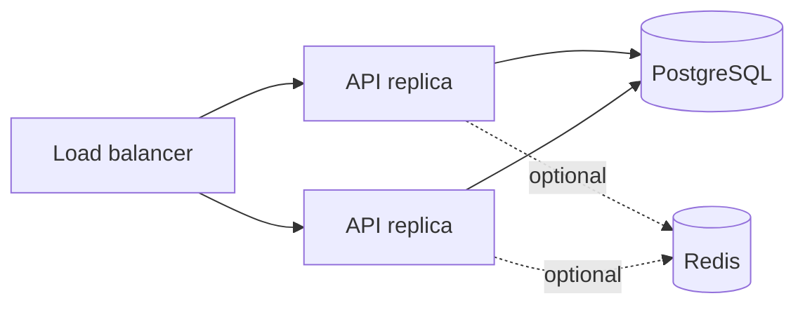

# 📘 Deployment model

  

  

## 🔹 Current topology

The repository produces one backend deployable. All business contexts run in the same NestJS process and scale as one stateless API unit.

## 🔹 Local topology

`docker compose up -d postgres` starts the local PostgreSQL dependency. The API runs from the host with `pnpm start:dev`. MongoDB and Redis are optional and are not started by the current compose file.

## 🔹 Production baseline

- Run multiple API replicas behind a load balancer.
- Keep containers stateless; store files in object storage, not the container filesystem.
- Use managed PostgreSQL with backups, point-in-time recovery, encryption, and restricted network access.
- Supply secrets through a secret manager or workload identity, never through committed files.
- Provision the required PostgreSQL schema through the external database release process before serving code that requires it.
- Centralize structured logs, metrics, traces, and audit events.
- Define health semantics that distinguish process liveness from dependency readiness before production rollout.
- Set resource limits, graceful shutdown, timeouts, retry policies, and rate limits explicitly.

## 🔹 Container

The `Dockerfile` builds the Nest API and starts `dist/apps/api/main.js`. The image should be scanned, pinned to an approved base-image policy, and run as a non-root user before production use.

## 🔹 Release gate

No release should rely on the scaffold's placeholder handlers. Verify API contracts, authorization, audit trails, data retention, and disaster-recovery procedures in the target environment.
