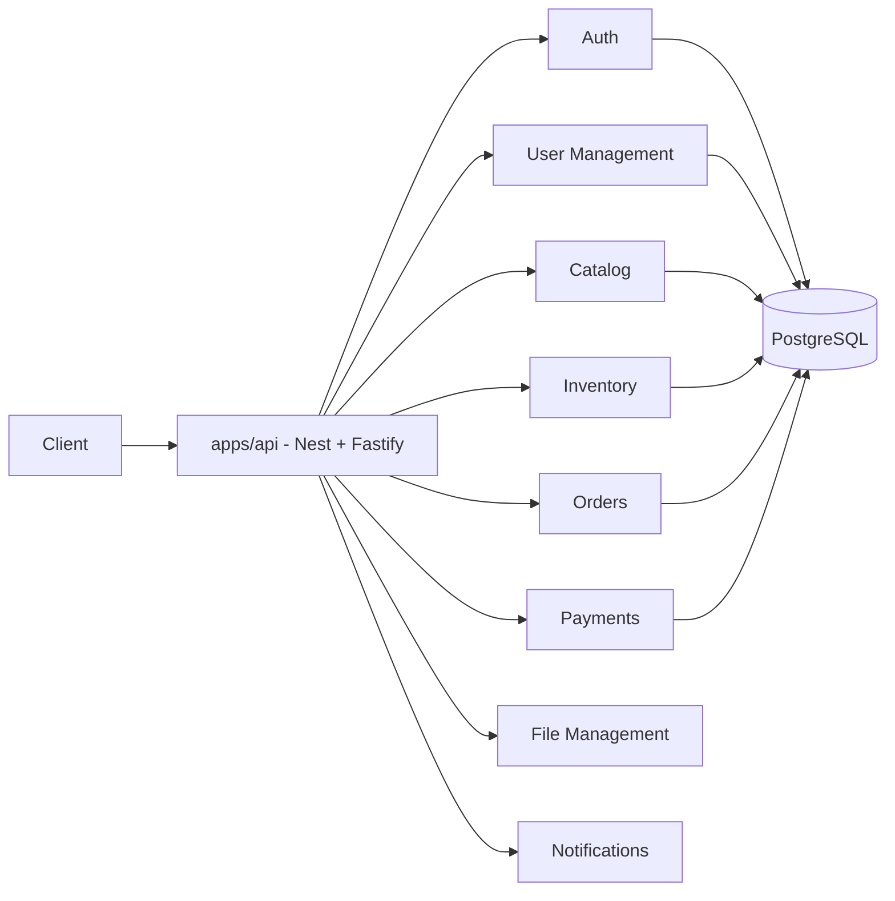
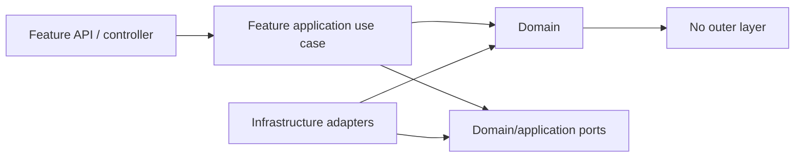

# Architecture

## 1. Decision

The platform is a **modular monolith**: one runtime/deployment unit, one Nest application composition root, and independently owned business bounded contexts.

The shared database **connection infrastructure** lives in `libs/platform/database`; table/entity/repository ownership lives inside each business module.

## 2. Why this shape

Your FastAPI reference already uses a healthy dependency flow: route -> service -> repository -> unit of work. This Nest structure preserves that discipline but strengthens team ownership by moving the HTTP boundary inside the bounded context and then splitting each context into feature slices.

For example, Auth does not have a 2,000-line `auth.controller.ts` or `auth.service.ts`. Registration, Login, Password Reset, MFA and token refresh each own their HTTP DTOs, handler and tests.

## 3. Dependency direction

Rules:

- Domain code is framework-agnostic where practical.
- Application code orchestrates use cases and depends on abstractions/ports.
- Infrastructure implements ports and owns TypeORM, external SDKs, queues, object storage, payment providers, etc.
- Controllers translate HTTP to application input and application output to HTTP.
- Cross-module access uses only another module's `public-api.ts` contract or an integration event.
- Never import another module's TypeORM entity or repository.

## 4. Vertical feature slices inside bounded contexts

`libs/modules/auth/src/features/login` is independent from `.../registration` and `.../reset-password`. Two developers changing login and reset-password should normally edit no common implementation file.

The bounded-context root module is primarily composition. It should change rarely after initial setup.

## 5. Shared kernel vs platform

`libs/shared-kernel` contains tiny stable domain-neutral types (e.g. domain event interfaces, pagination value objects). It must not contain business-specific DTOs, helpers or entities.

`libs/platform` contains technical infrastructure: config, database connection, logging, tracing, security primitives, cache and messaging. It must not contain business rules.

If something is specific to Orders, put it in Orders even if another module might eventually need it. Promote to a shared contract only after there is a real cross-module need.

## 6. Cross-module communication

Prefer, in order:

1. Same-module use-case call.
2. Synchronous public facade for a business decision needed immediately.
3. Domain/integration event for a reaction that can be decoupled.
4. Transactional outbox when an event must survive process/database failure and later move to a broker.

Do not create a web of direct service imports. A modular monolith with circular module dependencies is just a distributed monolith living in one process.

## 7. Database ownership

One PostgreSQL cluster/database is acceptable. Ownership is logical:

- every table has one owning bounded context;
- only that context writes through its repository;
- another context asks the owner through a facade/query contract rather than joining directly to private tables in application code;
- cross-context reporting should use dedicated read models/views, not business repositories reaching into foreign schemas.

For larger domains, PostgreSQL schemas per bounded context are recommended (`auth`, `users`, `catalog`, `inventory`, `orders`, etc.).

## 8. Transactions

Transactions are owned by application use cases. Repositories do not commit independently. Multi-row invariants and stock/payment/order transitions must use explicit transactions and database constraints/locks where needed.

Avoid a single transaction spanning external network calls. Use state transitions + idempotency + outbox/saga-style orchestration for payment, notification and third-party integrations.

## 9. CQRS

The skeleton includes `@nestjs/cqrs`, but CQRS is not mandatory for every CRUD endpoint. Use command/query handlers where the workflow benefits from explicit use-case objects. Do not add ceremony just to say the project uses CQRS.

## 10. Extraction readiness

A module is ready to become a microservice later when:

- other modules already call only its public API/contracts;
- it owns its data;
- events are explicit and versioned;
- no foreign repository/entity imports exist.

The architecture therefore preserves the option of later extraction without paying microservice operational cost today.
